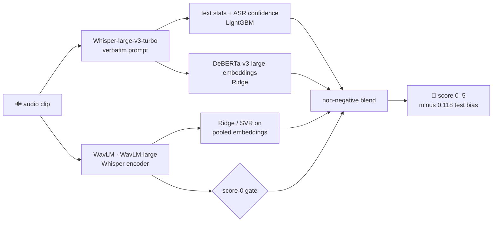

# 🎙️ Spoken Grammar Scoring

> *"he **don't** like it"* — what the speaker said
> *"he **doesn't** like it"* — what Whisper wrote
>
> Speech recognisers quietly fix grammar. That's great for subtitles and a problem when your job is to **grade** the grammar.

This repo is my entry for the **SHL Hiring Assessment 2026** Kaggle competition (`shl-hiring-assessment-2026`).
The model listens to 45–60 s of spontaneous spoken English and predicts a **0–5 grammar score**.

| | |
|---|---|
| 🏆 **Best public leaderboard** | **0.3262** (lower is better; #1 is 0.3239) |
| 📉 **Training RMSE** (out-of-fold, speaker-grouped) | **0.528** |
| 📈 **Training Pearson r** (out-of-fold) | **0.905** |
| 📓 **Notebook + full report** | [`notebook/shl_grammar_scoring.ipynb`](notebook/shl_grammar_scoring.ipynb) |
| 🌐 **Report as a web page** | [`report/index.html`](report/index.html) |

---

## 🧠 The idea in one picture



Every clip is judged two ways:

- **What was said** 📝 Whisper transcribes with a prompt full of fillers and mistakes, so it keeps the speaker's errors instead of correcting them.
- **How it was said** 🗣️ Frozen speech encoders capture fluency, rhythm and pronunciation. This turned out to be the strongest signal.
- **The score-0 gate** 🚪 The WavLM model separates all 37 score-0 training clips perfectly (they contain speech; the difference is acoustic), so those clips are set to exactly 0.

## 🕵️ Three things that mattered more than any model

1. **Speakers repeat.** Training clips come in "speaker twins". Random CV folds let a model recognise the voice, so all validation uses **speaker-grouped folds**, tuned to be as far from training as the test set is.
2. **Test clips are shorter.** 71% of test clips are ≤ 55 s, against 26% of training clips, and less audio means a lower prediction. Training on **test-length crops** (with transcripts of the crops) was the biggest leaderboard gain: 0.3454 → 0.3350.
3. **The leaderboard isn't pure RMSE.** Two probe submissions (v7 ± 0.2) showed a shift-invariant Pearson part *and* a test-set bias of **+0.118**. Removing it gave a predicted 0.3259–0.3264. Actual result: **0.3262**. ✅

## 📊 Leaderboard journey

| Version | What changed | Public |
|---|---|---|
| v1 | text + audio blend, score-0 gate | 0.3463 |
| v2 | + SVR on audio embeddings | 0.3454 |
| v3 | + WavLM-large, Whisper encoder | 0.3550 😬 |
| v4 | SVRs trained on test-length crops | 0.3384 |
| v6 | all models trained on 4 crops | 0.3373 |
| v7 | + text models on crop transcripts | 0.3350 |
| **v7 − 0.118** | **remove measured test-set bias** | **0.3262** 🏁 |

Tried and dropped: rounding to the 0.5 label grid (−0.02 on the leaderboard), a length correction, grammar-error features (T5 corrector, CoLA, GPT-2 perplexity), and end-to-end fine-tuning of DeBERTa and WavLM. The details are in [`submissions/README.md`](submissions/README.md).

## 🗂️ Pipeline

| Script | Step |
|---|---|
| `src/01_transcribe.py` | Whisper transcripts + ASR confidence (full clips and crops) |
| `src/02_text_features.py` | length-robust text statistics |
| `src/04_text_embed.py` | frozen DeBERTa-v3-large transcript embeddings |
| `src/05_audio_embed.py` | frozen WavLM / Whisper-encoder embeddings (full clips and crops) |
| `src/10_speaker_folds.py` | speaker-grouped CV folds |
| `src/03_train.py` | CV training of LightGBM / Ridge / SVR on any feature tables |
| `src/08_blend.py` | score-0 gate + non-negative blend → `artifacts/submission.csv` |

`src/common.py` holds paths and precision settings, so the same scripts run locally and on Kaggle. Each script caches its output in `artifacts/` for the next step.

## 🚀 Running it

**On Kaggle (easiest).** Attach the competition data and run the notebook on a 2× T4 GPU. It rebuilds everything from raw audio in about 3 hours and writes `submission.csv`.

**Locally.** Put the competition's `Dataset_Final/` under `data/`, then:

```bash
pip install -r requirements.txt
jupyter notebook notebook/shl_grammar_scoring.ipynb
```

Locally the notebook reuses the cached `artifacts/`. To run the heavy steps on Kaggle from your machine, `bash kaggle/run_job.sh <job>` uploads `src/`, runs the job as a kernel, waits and downloads the outputs.

> ⚠️ GTX 16xx cards produce NaNs in fp16, so `common.py` switches them to fp32.

---

<sub>Built by Aryan Awasthi for the SHL Hiring Assessment 2026.</sub>
